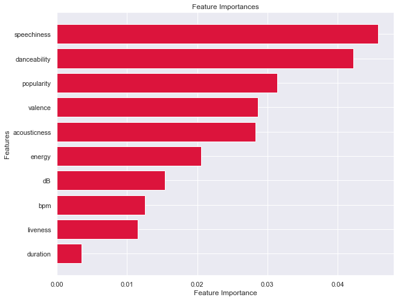

# Pop Genre Classification

**Author**: Andre Layton  
GitHub: @therookiescientist-andre

## Overview

  In the modern era, music consumption relies heavily on streaming services, with Spotify leading the way as one of the titans in the industry. Much of the appeal behind Spotify lies in its playlists and curated mixes. Consumers subscribe not only for the convenience, but partly in Spotify's ability to introduce new music to their attention. This requires algorithms that can recommend tracks similar, if not exactly, to the subscriber's preferences. For this reason, streaming companies have a need for classification systems that can also allow for personalized recommendations. With pop being one of the most popular genres in the world, this project will analyze track information, including audio features, to create a model that will best classify pop tracks.
  
## Business Problem

  Spotify executives are looking to improve their recommendation algorithms in order to gain more subscribers. The focus will be on pop songs specifically, and this will require an algorithm to correctly identify tracks that are & are not pop. I'll be using Spotify data from the last 24 years (excluding 2024) in order to build a model that will accomplish this task. 
***

## Data & Methods

  The data analysed was gathered from Kaggle. The dataset listed the top 100 songs from Spotify from the last 24 years (exlcuding 2024). The dataset is a combination of both numeric and categorical features, and will be studied to build a classification model that can best identify and classify pop songs, based on track information.

  After I explore the dataset and the distribution of the target variable, I clean up the dataframe by renaming columns and "dummying" out the genre column, in particular, in order to begin finding correlations and relationships. I use a heatmap to best show how each feature interacts with the pop song label, and begin my modeling process.
  
  
  
The heatmap shows that speechiness, danceability, and acousticness are the features that correlate strongly with the target, and are predictors worth observing throughout the analysis. I also study feature importance rankings to determine which features are best used to identify pop songs.
***

## Modeling

  The best model at identifying and classifying pop songs is the Support Vector Machine (SVM) model. The aim after building the baseline model is to improve precision, and thereby reducing the false positive count. The baseline model had a count of 165, which ultimately reduced to 100 after applying the SVM algorithm as shown below.
  
  
  
  The SVM model is 55.56% precise when attempting to classify tracks as pop or not pop. The model is also 62.5% accurate - both scores were within small distances away from their training counterparts, confirming the model did not overfit on the training dataset. The AUC score was also at its highest at .610, further determining the SVM model as the best model in this analysis.
 
  The next visual takes a look into the features and their importance to this model's classification task. The plot ranks each feature, in descending order, according to their importance in the model's information gain. 

  
  
  The chart above shows that speechiness, danceability, and popularity are the most important features to this model and the target variable. The first two predictors were noted above in the heatmap to be significant, and correlates strongly with the target, and more importantly, the model. 

***


## Results & Conclusions

This analysis leads to the following conclusions:

   1. The Support Vector Machine (SVM) model served as our best algorithm for identifying pop songs and classifying them correctly.

   2. The most important features for identifying a pop track is its *speechiness*, *danceability*, *acousticness* & *popularity*. The first two features have strong correlations with the target, and the other half exhibit similar importance to the model in its classification task.

This project is limited in a few ways, the first being it only takes into account the top 100 songs from the last 23 years. In addition, the genres in the original dataset varied and listed many subgenres, which complicated the analysis. Lastly, the range of hyperparameters selected for our parameter grids could have been selected better; however, this would have been computationally heavy. This limited the range we could include and analyze, leaving much to be desired.

Further analyses could yield additional insights to which features are important to an effective classifier, and possibly improve our algorithm. Some possible courses of action we could take include dimensionality reduction, in order to reduce the noise in the dataset that may be causing our low precision scores. In addition, we could consolidate the other genres in the dataset in order to make classification easier; however, this would be an unrealistic (or "ideal") analysis due to the subjective nature behind music genres. we could also feed more data and track information in order to train our models to better identify other genres and continue to improve our precision.
***


## Repository Contents
***
Below is a list of the contents of this repository.

```
├── README.md             
├── images   
├── .gitignore
├── Pop_Genre_Classifier.ipynb
├── svm_model.pkl                                
└── Presentation.pdf                         
```
